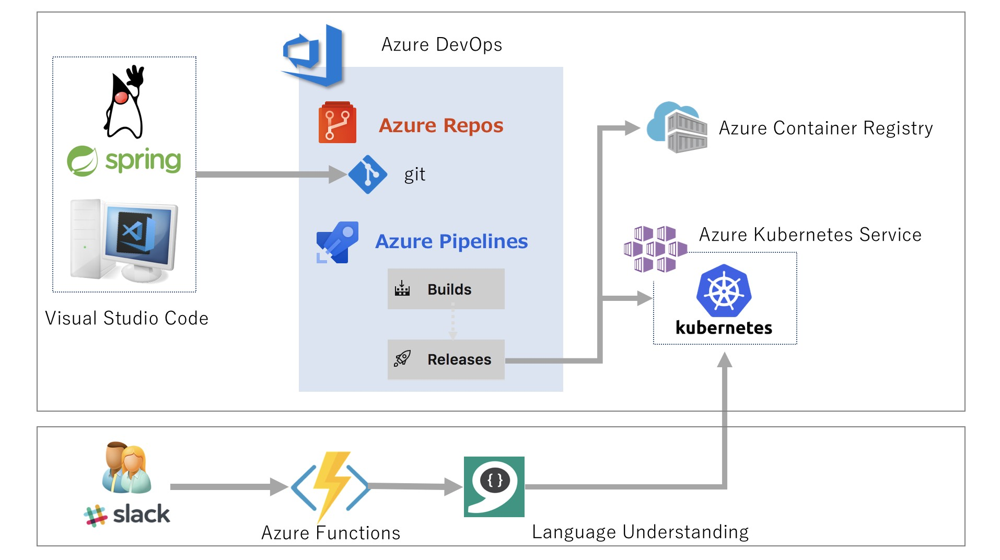
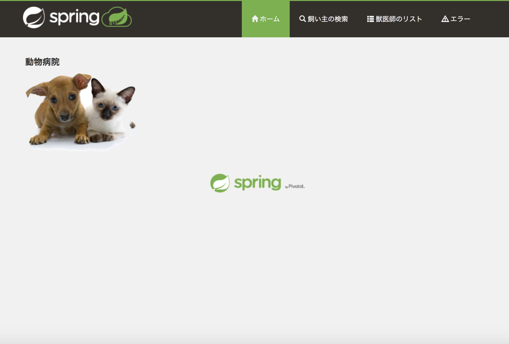
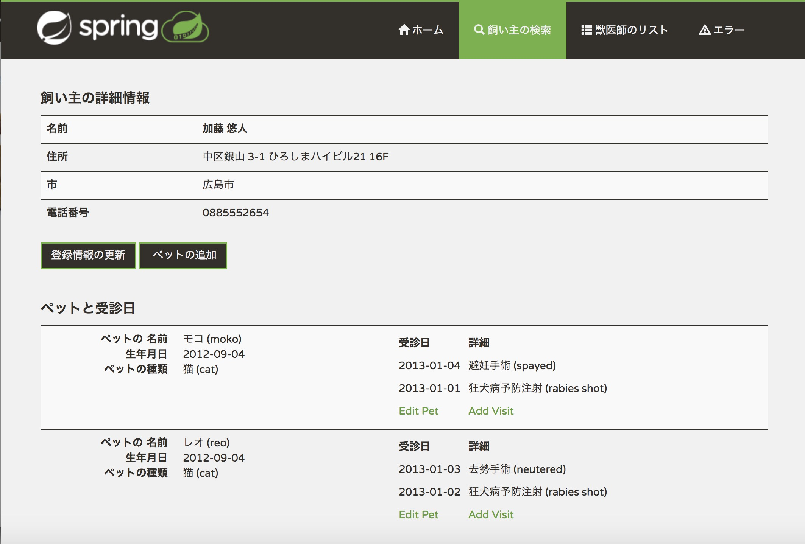
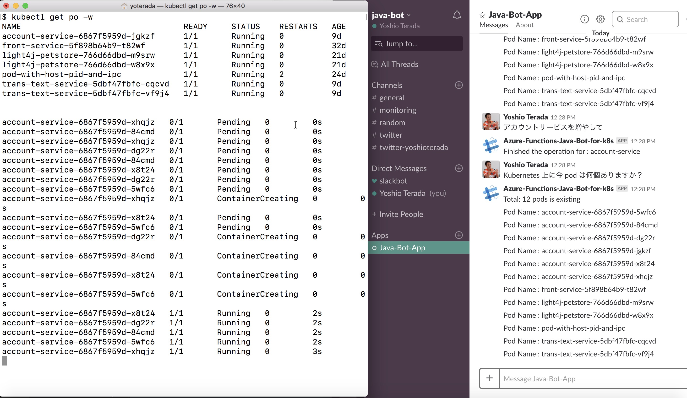

# Microsoft Tech Summit 2018 デモ概要

<u>デモ内容</u>

1. Azure DevOps プロジェクトのデモ
2. Azure Dev Spaces のデモ
3. Slack から Kubernetes を操作するデモ



<u>本デモンストレーションで利用する Azure Technology 一覧</u>  

***Azure DevOps デモ***  

* [Spring Boot : Java Application](https://github.com/spring-projects/spring-petclinic)  
* [Azure DevOps Services](https://azure.microsoft.com/ja-jp/services/devops/)  
* [Azure Container Registry](https://azure.microsoft.com/ja-jp/services/container-registry/)  
* [Azure Kubernetes Service](https://azure.microsoft.com/ja-jp/services/kubernetes-service/)
* [Azure Dev Spaces](https://docs.microsoft.com/ja-jp/azure/dev-spaces/)

***Slack デモ*** 
 
* [Azure Bot Service](https://azure.microsoft.com/ja-jp/services/bot-service/)
* [Bot Builder SDK v4 (Java) (Preview)](https://github.com/Microsoft/botbuilder-java)
* [Azure Functions for Java](https://docs.microsoft.com/ja-jp/azure/azure-functions/functions-reference-java)
* [Kubernetes Java Client](https://github.com/kubernetes-client/java)
* [Language Understanding (LUIS)](https://www.luis.ai/)
* [Microsoft Speech Services](https://azure.microsoft.com/ja-jp/services/cognitive-services/speech-services/)


# 1. Azure DevOps プロジェクトのデモ

## 1.1 Spring Boot PetClinit Application

* [Spring Boot PetClinit Application](https://github.com/spring-projects/spring-petclinic) を入手  




## 1.2 Azure DevOps Project

[Azure DevOps Project](https://azure.microsoft.com/ja-jp/services/devops/) を利用するとブラウザからほんの数クリックで CI/CD 環境を構築することができます。DevOps プロジェクトは、プログラミング言語の種類によらず、様々なプログラミング言語で利用できます。本デモでは Java のプロジェクトを利用し Java のビルド・パイプラインの構築から、Kubernetes (AKS) へのデプロイを行うリリース・パイプラインまでをデモでご紹介します。

<u>手順</u>
  
1. Azure DevOps の git Repos へソースコードをプッシュ
2. ソースコードのクローン
```
$ git clone  https://USER_NAME@dev.azure.com/$DEVOPS_PROJECT_NAME/spring-app/_git/spring-app
```
3. ソースコードの一部修正
```
例：Application/src/main/resources/templates/welcome.html
```
4. プルリクエストの送信
5. ソースコードのマージ
6. ソースコードのコミット
7. CI & CD の実行
8. Azure Kubernetes Service (AKS) へデプロイ
9. 結果の確認（ブラウザ）
10. 結果の確認（kubectl コマンド)

# 2. Azure Dev Spaces のデモ

Auzre Dev Spaces を利用すると、Visual Studio Code から Kubernetes 上で稼働している Java Application (Spring Boot) をリモート・デバッグできるようになります。まだ Preview の機能ですが、Kubernetes 上のアプリケーションをリモート・デバッグ、さらには無停止更新などができるようになる事で開発効率の向上が期待できます。

Java で利用する場合、[Azure Dev Spaces のセットアップ (Java) 手順](https://docs.microsoft.com/ja-jp/azure/dev-spaces/quickstart-java)をご参照ください。また、実際の Azure Dev Spaces 動作は [こちらの動画](https://youtu.be/p2jmkgNWKP4) からご確認いただけます。

[](https://youtu.be/p2jmkgNWKP4)

# 3. Slack から Kubernetes を操作するデモ
Microsoft は Azure Bot Service を提供しています。Azure Bot Service を利用すると Slack をはじめとし、Web サイト、アプリ、Cortana、Microsoft Teams、Skype、Facebook Messenger などで自然なやりとりができるインテリジェントなボットを構築、接続、デプロイ、管理できます。



[Bot Builder SDK v4 (Java) (Preview)](https://github.com/Microsoft/botbuilder-java) を利用する事で Java のアプリケーションからも簡単にボットのアプリケーションを作成できます。今回のデモでは、[Azure Functions for Java](https://docs.microsoft.com/ja-jp/azure/azure-functions/functions-reference-java) でボットを構築し、自然言語解析は [Language Understanding (LUIS)](https://www.luis.ai/) を利用し、ユーザから入力された内容がどのような内容なのかを判定します。  
さらに、入力内容に応じて、[Kubernetes Java Client](https://github.com/kubernetes-client/java) を利用して、ボットから k8s を操作(pod 数の出力、pod の増減)します。

